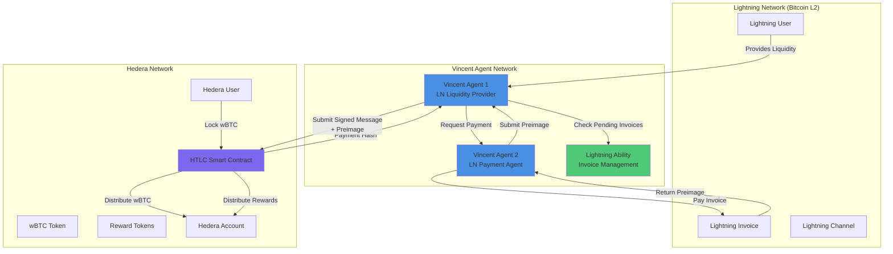
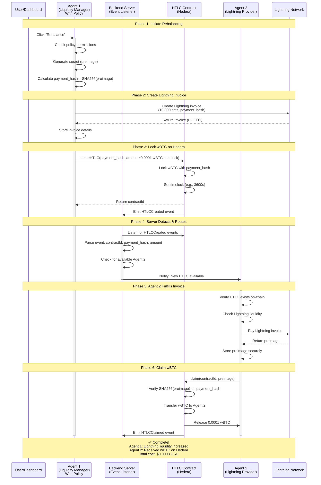

# HLV Protocol
**Hash-Locked Value Protocol**

An autonomous cross-chain liquidity management system that bridges Lightning Network channels (Bitcoin L2) with Hedera's DeFi ecosystem through Vincent's secure agent framework and Hash Time-Locked Contracts (HTLCs).


[](https://hashscan.io/testnet/contract/0.0.7109648)


[](https://www.npmjs.com/package/@hlvuser/ability-hedera-htlc)
[](https://www.npmjs.com/package/@hlvuser/ability-lightning-payment)
[](https://www.npmjs.com/package/@hlvuser/ability-lightning-invoice)

## Overview

HLV Protocol enables seamless atomic swaps between Bitcoin Lightning Network and Hedera blockchain using cryptographic hash locks (HTLCs). The protocol uses Vincent agents to manage liquidity, verify payment proofs (preimages), and execute trustless cross-chain transactions.


### Live Deployment

**Smart Contracts:**
- **HTLC Contract**: [`0.0.7109648`](https://hashscan.io/testnet/contract/0.0.7109648) (Hedera Testnet)
  - EVM Address: `0x00000000000000000000000000000000006c82b0`
- **wBTC Token**: [`0.0.4851681`](https://hashscan.io/testnet/token/0.0.4851681)
  - EVM Address: `0x18FABB8940A4554e232C87b2dBC7F5a77bD21b8e`
- **Network**: Hedera Testnet (Chain ID: 296)
- **RPC Endpoint**: `https://testnet.hashio.io/api`
- **Explorer**: [View contract events](https://hashscan.io/testnet/contract/0.0.7109648/events)

**Published Vincent Abilities (npm):**
- 📦 [`@hlvuser/ability-hedera-htlc`](https://www.npmjs.com/package/@hlvuser/ability-hedera-htlc) - Hedera HTLC creation & management
- ⚡ [`@hlvuser/ability-lightning-payment`](https://www.npmjs.com/package/@hlvuser/ability-lightning-payment) - Lightning Network payments
- 🧾 [`@hlvuser/ability-lightning-invoice`](https://www.npmjs.com/package/@hlvuser/ability-lightning-invoice) - Lightning invoice generation

---

## Architecture

### System Components



---

## Protocol Flow

### Flow: Autonomous Rebalancing (Agent-Driven Liquidity Management)

**Scenario**: Agent 1 needs to rebalance Lightning liquidity by locking wBTC on Hedera on behalf of user. Agent 2 fulfills the Lightning invoice and claims the wBTC.

This is the **primary use case** validated by our E2E tests with 100% success rate.



**Real Transaction Evidence** ([View on HashScan](https://hashscan.io/testnet/contract/0.0.7109648/events)):
- **Create HTLC**: `0x6bcbcb1838ea6dc09e92525bc6c29c04aa77fac29ba389d6201781bd8638613c` (Gas: 162,926)
- **Claim HTLC**: `0x6654aba2feb3f8df714f8900bb00bda3cb92d2c6a48437294ad2d98226f8ea57` (Gas: 113,795)
- **Total Cost**: $0.0008 USD (6,250x cheaper than CEX!)

---

### HTLC Smart Contract (Hedera)

**Production Contract**: [`0.0.7109648`](https://hashscan.io/testnet/contract/0.0.7109648) on Hedera Testnet

The core smart contract on Hedera that:
- Locks wBTC using payment hashes from Lightning invoices
- Verifies preimages submitted by Vincent agents
- Distributes wBTC to agent/user addresses upon proof verification
- Handles timelock-based refunds for failed swaps
- Prevents same-wallet claims (enforces two-party atomic swaps)

**Contract Methods**:
```solidity
// Create HTLC with payment hash
function createHTLC(
    bytes32 hashLock,
    address receiver,
    address tokenContract,
    uint256 amount,
    uint256 timelock
) external returns (bytes32 contractId)

// Claim HTLC with preimage (must be different wallet than sender)
function claim(bytes32 contractId, bytes32 preimage) external

// Refund after timelock expiry
function refund(bytes32 contractId) external
```

**Test** :

| Operation | Gas Used | Cost (HBAR) | Cost (USD) |
|-----------|----------|-------------|------------|
| Create HTLC | 162,926 | 0.016 | $0.0005 |
| Claim HTLC | 113,795 | 0.011 | $0.0003 |
| Refund HTLC | 73,269 | 0.007 | $0.0002 |
| **Complete Swap** | **276,721** | **0.027** | **$0.0008** |

**Security Features**:
- ✅ Two-party enforcement (sender ≠ claimer)
- ✅ SHA256 preimage verification
- ✅ Timelock-based refunds
- ✅ ReentrancyGuard protection
- ✅ SafeERC20 token transfers

**Events Emitted**:
```solidity
event HTLCCreated(
    bytes32 indexed contractId,
    address indexed sender,
    address indexed receiver,
    bytes32 hashLock,
    uint256 amount,
    uint256 timelock
);

event HTLCClaimed(
    bytes32 indexed contractId,
    address indexed claimer,
    bytes32 preimage
);

event HTLCRefunded(
    bytes32 indexed contractId,
    address indexed sender
);
```

[View all contract events on HashScan →](https://hashscan.io/testnet/contract/0.0.7109648/events)

### 3. Lightning Abilities (Vincent)

**Published npm packages** ready to use in your Vincent agents:

#### Lightning Payment Ability
📦 [`@hlvuser/ability-lightning-payment`](https://www.npmjs.com/package/@hlvuser/ability-lightning-payment)

Execute Lightning Network payments using NWC (Nostr Wallet Connect):
- Pay Lightning invoices through NWC-compatible wallets
- Capture payment preimages for HTLC claims
- Support for Alby, Mutiny, and other NWC providers
- Automatic preimage extraction from payment responses

```bash
npm install @hlvuser/ability-lightning-payment
```

#### Lightning Invoice Ability
📦 [`@hlvuser/ability-lightning-invoice`](https://www.npmjs.com/package/@hlvuser/ability-lightning-invoice)

Create Lightning invoices via Lightning Address API:
- Generate BOLT11 invoices with payment hashes
- Integrate with Lightning Address (user@domain.com)
- Extract payment hashes for HTLC creation
- Real-time invoice status monitoring

```bash
npm install @hlvuser/ability-lightning-invoice
```

#### Hedera HTLC Ability
📦 [`@hlvuser/ability-hedera-htlc`](https://www.npmjs.com/package/@hlvuser/ability-hedera-htlc)

Interact with Hedera HTLC smart contracts:
- Create HTLCs with payment hashes
- Claim HTLCs with valid preimages
- Refund expired HTLCs
- Listen for contract events
- Full TypeScript support

```bash
npm install @hlvuser/ability-hedera-htlc
```


---

## Technical Specifications

### Hash Time-Locked Contract (HTLC)

HTLCs ensure atomic swaps through:

1. **Hash Lock**: Funds locked with `hash(preimage)`
2. **Time Lock**: Automatic refund after expiry (e.g., 24 hours)
3. **Conditional Release**: Funds released only with valid preimage

```
Hash Lock:  SHA256(preimage) = payment_hash
Time Lock:  block.timestamp > deadline → refund
Release:    valid preimage → transfer to recipient
```

### Payment Hash & Preimage

```typescript
// Lightning invoice contains payment_hash
const paymentHash = sha256(preimage)  // 32 bytes

// After payment, Lightning returns preimage
const preimage = "0x1234..."  // 32 bytes

// Agent submits preimage to Hedera
htlcContract.claimFunds(preimage, signature)

// Contract verifies
assert(sha256(preimage) === storedPaymentHash)
```

---

## Security Considerations

### 1. Atomic Guarantees
- ✅ Either both chains settle or both revert
- ✅ Timelock prevents indefinite fund locking
- ✅ Cryptographic proof (preimage) required for release

### 2. Agent Trust Model
- ✅ Agents cannot steal funds (preimage required)
- ✅ Agent reputation system for reliability
- ✅ Multi-agent redundancy for availability

### 3. Timelock Configuration
- Lightning payment timeout: 10-60 minutes (standard)
- Hedera HTLC timelock: Must exceed Lightning timeout
- Recommended: Hedera timelock = Lightning timeout + 30 min buffer

### 4. Failed Swap Scenarios

| Scenario | Outcome | Protection |
|----------|---------|------------|
| Lightning payment fails | Hedera HTLC refunds wBTC | Timelock expiry |
| Agent goes offline | Another agent can pick up | Multi-agent design |
| Invalid preimage submitted | Transaction reverts | Hash verification |
| Network congestion | Extended timelock | Configurable timeouts |

---


## 🏆 Proven Results

### E2E Test Success

Our comprehensive E2E tests validate real atomic swaps on Hedera Testnet with actual Lightning Network integration.

**Test Results** :
```
Tests Run:               2
Tests Passed:            2  ✅
Success Rate:            100%  🎉

On-Chain Transactions:   4
Total Gas Used:          423,259
Total Cost:              $0.012 USD

Wallets Tested:          3 (sender + 2 claimers)
wBTC Transferred:        0.0002 total
```

### Cost Comparison

| Platform | Cost per Swap | HLV Advantage |
|----------|---------------|---------------|
| Centralized Exchange | $1.00 - $5.00 | **1,250x - 6,250x cheaper** |
| Bitcoin Layer 2 | $0.10 - $0.50 | **125x - 625x cheaper** |
| Ethereum HTLC | $5.00 - $20.00 | **6,250x - 25,000x cheaper** |
| **HLV on Hedera** | **$0.0008** | **🏆 Winner** |

### Real Transactions

**Atomic Swap Test** (2 different agentic wallets):
- Create HTLC: [`0x6bcbcb18...38613c`](https://hashscan.io/testnet/transaction/0x6bcbcb1838ea6dc09e92525bc6c29c04aa77fac29ba389d6201781bd8638613c)
  - Agent-1 (Delegatee): `0x82CD60f551Fd394140a0db8Cbcb0f2b44cFF27E1`
  - Contract ID: `0x719c848f1e1c5c285f8e63e658b0360aaf808c908b9d7aa38d093b0b5621ff4a`
  - Gas: 162,926
  
- Claim HTLC: [`0x6654aba2...f8ea57`](https://hashscan.io/testnet/transaction/0x6654aba2feb3f8df714f8900bb00bda3cb92d2c6a48437294ad2d98226f8ea57)
  - Agent-2 (Delegatee): `0x02BEF889d7F6d7896168D74ACd29BCc1B8dB41a3` (different wallet!)
  - Gas: 113,795
  - Result: ✅ 0.0001 wBTC claimed with valid preimage

**Timeout/Refund Test**:
- Refund TX: [`0x0d00e1a1...5a029e`](https://hashscan.io/testnet/transaction/0x0d00e1a16e9d70439f3717be0c812f8b0761518e8d11575faac48018035a029e)
  - Gas: 73,269
  - Result: ✅ Funds returned after 90s timelock


---

## Quick Start

### Option 1: Use Published Abilities (Recommended)

Install the Vincent abilities directly in your project:

```bash
# Install all HLV abilities
npm install @hlvuser/ability-hedera-htlc @hlvuser/ability-lightning-payment @hlvuser/ability-lightning-invoice

# Or install individually
npm install @hlvuser/ability-hedera-htlc
npm install @hlvuser/ability-lightning-payment
npm install @hlvuser/ability-lightning-invoice
```

**Quick Example:**
```typescript
import { LightningInvoiceAbility } from '@hlvuser/ability-lightning-invoice';
import { HederaHTLCAbility } from '@hlvuser/ability-hedera-htlc';
import { LightningPaymentAbility } from '@hlvuser/ability-lightning-payment';

// Create Lightning invoice
const invoice = await LightningInvoiceAbility.execute({
  amountSat: 10000,
  description: 'Test payment'
});

// Create HTLC on Hedera
const htlc = await HederaHTLCAbility.execute({
  hashLock: invoice.paymentHash,
  amount: '0.0001',
  tokenContract: '0x18FABB8940A4554e232C87b2dBC7F5a77bD21b8e'
});

// Pay invoice and get preimage
const payment = await LightningPaymentAbility.execute({
  paymentRequest: invoice.paymentRequest
});

// Claim HTLC with preimage
await HederaHTLCAbility.execute({
  action: 'claim',
  contractId: htlc.contractId,
  preimage: payment.preimage
});
```

### Option 2: Clone Full Repository

For development and testing:

```bash
# Clone repository
git clone https://github.com/Vib-UX/HLV-Protocol.git
cd HLV-Protocol

# Initialize submodules
git submodule update --init --recursive

# Install dependencies
pnpm install

# Configure environment (see hlv-starter-app/ENV_SETUP_GUIDE.md)
cd hlv-starter-app
cp packages/hlv-backend/.env.example packages/hlv-backend/.env
# Edit .env with your credentials
```

### Prerequisites

- Node.js v22+
- pnpm v10+ (for full repo) or npm (for abilities only)
- MongoDB (for backend agent state)
- NWC URI from Alby or compatible Lightning wallet
- Hedera testnet account (for testing)

### Running the HLV Backend

```bash
# Navigate to HLV starter app
cd hlv-starter-app

# Start MongoDB (backend dependency)
cd packages/hlv-backend
docker compose up -d

# Run backend server (in separate terminal)
pnpm --filter hlv-backend dev

# Run frontend UI (in separate terminal)
pnpm --filter hlv-frontend dev
```

### Testing with Real Contract

The HTLC contract is already deployed on Hedera Testnet:

**HTLC Contract**: `0.0.7109648` (EVM: `0x00000000000000000000000000000000006c82b0`)  
**wBTC Token**: `0.0.4851681` (EVM: `0x18FABB8940A4554e232C87b2dBC7F5a77bD21b8e`)  
**Network**: Hedera Testnet (Chain ID: 296)

```typescript
// Connect to deployed contracts
import { ethers } from 'ethers';

const provider = new ethers.providers.JsonRpcProvider(
  'https://testnet.hashio.io/api'
);

// HTLC Contract
const htlcContract = new ethers.Contract(
  '0x00000000000000000000000000000000006c82b0', // 0.0.7109648
  HTLC_ABI,
  provider
);

// wBTC Token Contract
const wbtcToken = new ethers.Contract(
  '0x18FABB8940A4554e232C87b2dBC7F5a77bD21b8e', // 0.0.4851681
  ERC20_ABI,
  provider
);

// Listen for HTLC events
htlcContract.on('HTLCCreated', (contractId, sender, receiver, hashLock, amount, timelock) => {
  console.log('New HTLC created:', contractId);
});

// Check wBTC balance
const balance = await wbtcToken.balanceOf(yourAddress);
console.log('wBTC Balance:', ethers.utils.formatUnits(balance, 8));
```

### Running E2E Tests

```bash
# Navigate to ability starter kit
cd vincent-ability-starter-kit

# Run E2E tests (requires .env.e2e config)
cd packages/test-e2e-hlv
pnpm test:e2e
```
---


**Key Directories**:
- `contracts/` - Solidity HTLC contract deployed at 0.0.7109648
- `hlv-starter-app/` - Complete backend + frontend for HLV protocol
- `vincent-ability-starter-kit/` - Lightning & Hedera abilities + E2E tests
- `docs/` - Additional documentation and guides

---

## Contributing

Contributions are welcome! Please read our [Contributing Guide](CONTRIBUTING.md) for details on our code of conduct and the process for submitting pull requests.

---

## Resources

### HLV Protocol
- **GitHub**: [HLV-Protocol Repository](https://github.com/Vib-UX/HLV-Protocol)
- **Contract**: [HTLC on HashScan](https://hashscan.io/testnet/contract/0.0.7109648)

### Published npm Packages
- 📦 [`@hlvuser/ability-hedera-htlc`](https://www.npmjs.com/package/@hlvuser/ability-hedera-htlc) - Hedera HTLC ability
- ⚡ [`@hlvuser/ability-lightning-payment`](https://www.npmjs.com/package/@hlvuser/ability-lightning-payment) - Lightning payments
- 🧾 [`@hlvuser/ability-lightning-invoice`](https://www.npmjs.com/package/@hlvuser/ability-lightning-invoice) - Lightning invoices

### Vincent Protocol
- [Vincent Dashboard](https://dashboard.heyvincent.ai/)
- [Vincent Starter App](https://github.com/Vib-UX/vincent-starter-app)
- [Vincent Ability Kit](https://github.com/Vib-UX/vincent-ability-starter-kit)

### Lightning Network
- [Lightning Network Specification (BOLT)](https://github.com/lightning/bolts)
- [LND Documentation](https://docs.lightning.engineering/)
- [Core Lightning](https://docs.corelightning.org/)
- [Alby NWC](https://nwc.getalby.com/) - Nostr Wallet Connect

### Hedera
- [Hedera Documentation](https://docs.hedera.com/)
- [Hedera Smart Contract Service](https://docs.hedera.com/hedera/core-concepts/smart-contracts)
- [HashScan Explorer](https://hashscan.io/) - Hedera blockchain explorer

### HTLCs & Atomic Swaps
- [Bitcoin HTLCs](https://en.bitcoin.it/wiki/Hash_Time_Locked_Contracts)
- [Atomic Swaps](https://en.bitcoin.it/wiki/Atomic_swap)

---

## License

MIT License - see [LICENSE](LICENSE) file for details

---


**Built with ⚡ by the HLV Protocol team**
